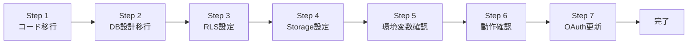

# 開発者向け 本番環境移行手順書

このドキュメントは、開発環境から本番環境（お客様の環境）へコードとデータを移行する際の詳細手順をまとめたものです。

---

## 📌 前提条件

### お客様側で完了していること

- ✅ GitHubリポジトリ作成・コラボレーター招待完了
- ✅ Supabaseプロジェクト作成・コラボレーター招待完了
- ✅ Google OAuth設定完了
- ✅ Vercelプロジェクト作成・環境変数設定完了
- ✅ 初回デプロイ成功

### 開発者側で完了していること

- ✅ ローカル開発環境の動作確認完了
- ✅ 開発用Supabaseプロジェクトでの動作確認完了
- ✅ 各機能のテスト完了

### 必要な情報

お客様から以下の情報を受け取っていることを確認：

- [ ] 本番GitHubリポジトリURL
- [ ] 本番Supabase Project URL
- [ ] 本番Supabase anon key
- [ ] 本番Supabase Database Password（必要に応じて）
- [ ] 本番Google OAuth Client ID & Secret
- [ ] 本番Vercel デプロイURL

---

## 🔄 移行手順の全体像



---

## 📄 Step 1: コードの移行

### 1-1. 開発環境の最終確認

```bash
# ローカルで最終動作確認
cd /path/to/koji-project
npm run dev

# ブラウザで動作確認
# http://localhost:3000
```

確認項目：
- [ ] ログイン・ログアウト機能
- [ ] ホーム画面表示
- [ ] プロフィール画面表示
- [ ] AI制作モード画面表示
- [ ] レシピ投稿機能（実装済みの場合）
- [ ] お気に入り機能（実装済みの場合）

### 1-2. 不要なファイルの削除

```bash
# 一時ファイル・キャッシュの削除
rm -rf .next
rm -rf node_modules
rm -rf .turbo

# 環境変数ファイルの確認（.gitignoreで除外されているか）
cat .gitignore | grep .env.local
```

### 1-3. コミット・プッシュ

```bash
# 最終変更をコミット
git add -A
git commit -m "feat: 本番環境移行準備完了"

# 現在のリモートを確認
git remote -v

# 本番リポジトリをリモートに追加（または変更）
git remote set-url origin https://github.com/お客様のアカウント/koji-recipe-app.git

# プッシュ（Personal Access Token使用の場合）
git push -u origin main
```

⚠️ **注意**: Personal Access Tokenが必要な場合：
```bash
# トークンを含むURLでpush
git push https://TOKEN@github.com/お客様のアカウント/koji-recipe-app.git main
```

### 1-4. Vercelでの自動デプロイ確認

1. Vercelダッシュボードにアクセス
2. プロジェクトを選択
3. 「Deployments」タブで最新デプロイを確認
4. ステータスが「Ready」になることを確認

---

## 🗄️ Step 2: データベーススキーマの移行

### 2-1. 開発環境のスキーマをエクスポート

Supabase開発環境（あなたのプロジェクト）から：

1. Supabaseダッシュボード → 「SQL Editor」
2. 「New query」で以下のSQLを実行：

```sql
-- 現在のテーブル一覧を確認
SELECT table_name 
FROM information_schema.tables 
WHERE table_schema = 'public';
```

3. 各テーブルの定義を取得：

```sql
-- テーブル定義の取得（例: postsテーブル）
SELECT 
    column_name,
    data_type,
    is_nullable,
    column_default
FROM information_schema.columns
WHERE table_name = 'posts'
ORDER BY ordinal_position;
```

### 2-2. スキーマSQLの作成

開発環境のテーブル定義をもとに、本番環境用のSQLを作成：

#### **users テーブル**

```sql
-- ユーザー情報テーブル
-- SupabaseのAuth.usersと連携
CREATE TABLE IF NOT EXISTS public.users (
  id UUID PRIMARY KEY REFERENCES auth.users(id) ON DELETE CASCADE,
  email TEXT UNIQUE NOT NULL,
  display_name TEXT,
  avatar_url TEXT,
  bio TEXT,
  created_at TIMESTAMP WITH TIME ZONE DEFAULT NOW(),
  updated_at TIMESTAMP WITH TIME ZONE DEFAULT NOW()
);

-- インデックス
CREATE INDEX IF NOT EXISTS users_email_idx ON public.users(email);

-- 更新日時の自動更新
CREATE OR REPLACE FUNCTION update_updated_at()
RETURNS TRIGGER AS $$
BEGIN
  NEW.updated_at = NOW();
  RETURN NEW;
END;
$$ LANGUAGE plpgsql;

CREATE TRIGGER update_users_updated_at
  BEFORE UPDATE ON public.users
  FOR EACH ROW
  EXECUTE FUNCTION update_updated_at();
```

#### **posts テーブル**

```sql
-- レシピ投稿テーブル
CREATE TABLE IF NOT EXISTS public.posts (
  id UUID PRIMARY KEY DEFAULT gen_random_uuid(),
  user_id UUID NOT NULL REFERENCES public.users(id) ON DELETE CASCADE,
  title TEXT NOT NULL,
  description TEXT,
  koji_type TEXT NOT NULL, -- '米麹' | '麦麹' | '豆麹'
  fermentation_time TEXT, -- '1週間' | '2週間' 等
  difficulty TEXT, -- 'かんたん' | 'ふつう' | 'むずかしい'
  ingredients JSONB, -- [{ name: '材料名', amount: '分量' }]
  steps JSONB, -- [{ order: 1, description: '手順説明', image_url: '' }]
  image_url TEXT,
  is_public BOOLEAN DEFAULT true,
  is_ai_generated BOOLEAN DEFAULT false,
  view_count INTEGER DEFAULT 0,
  like_count INTEGER DEFAULT 0,
  created_at TIMESTAMP WITH TIME ZONE DEFAULT NOW(),
  updated_at TIMESTAMP WITH TIME ZONE DEFAULT NOW()
);

-- インデックス
CREATE INDEX IF NOT EXISTS posts_user_id_idx ON public.posts(user_id);
CREATE INDEX IF NOT EXISTS posts_created_at_idx ON public.posts(created_at DESC);
CREATE INDEX IF NOT EXISTS posts_view_count_idx ON public.posts(view_count DESC);
CREATE INDEX IF NOT EXISTS posts_like_count_idx ON public.posts(like_count DESC);
CREATE INDEX IF NOT EXISTS posts_koji_type_idx ON public.posts(koji_type);

-- 更新日時の自動更新
CREATE TRIGGER update_posts_updated_at
  BEFORE UPDATE ON public.posts
  FOR EACH ROW
  EXECUTE FUNCTION update_updated_at();
```

#### **likes テーブル**

```sql
-- お気に入りテーブル
CREATE TABLE IF NOT EXISTS public.likes (
  id UUID PRIMARY KEY DEFAULT gen_random_uuid(),
  user_id UUID NOT NULL REFERENCES public.users(id) ON DELETE CASCADE,
  post_id UUID NOT NULL REFERENCES public.posts(id) ON DELETE CASCADE,
  created_at TIMESTAMP WITH TIME ZONE DEFAULT NOW(),
  UNIQUE(user_id, post_id) -- 同じユーザーが同じ投稿を複数回お気に入りできないように
);

-- インデックス
CREATE INDEX IF NOT EXISTS likes_user_id_idx ON public.likes(user_id);
CREATE INDEX IF NOT EXISTS likes_post_id_idx ON public.likes(post_id);
CREATE INDEX IF NOT EXISTS likes_created_at_idx ON public.likes(created_at DESC);
```

#### **views テーブル**

```sql
-- PV計測テーブル
CREATE TABLE IF NOT EXISTS public.views (
  id UUID PRIMARY KEY DEFAULT gen_random_uuid(),
  post_id UUID NOT NULL REFERENCES public.posts(id) ON DELETE CASCADE,
  user_id UUID REFERENCES public.users(id) ON DELETE SET NULL, -- ログインユーザーの場合
  session_id TEXT, -- 匿名ユーザーの場合
  ip_address TEXT,
  user_agent TEXT,
  created_at TIMESTAMP WITH TIME ZONE DEFAULT NOW()
);

-- インデックス
CREATE INDEX IF NOT EXISTS views_post_id_idx ON public.views(post_id);
CREATE INDEX IF NOT EXISTS views_created_at_idx ON public.views(created_at DESC);
CREATE INDEX IF NOT EXISTS views_session_id_idx ON public.views(session_id);
```

### 2-3. 本番環境にスキーマを適用

1. **本番Supabaseダッシュボード**にアクセス
2. 「SQL Editor」→「New query」
3. 上記SQLを**順番に**実行：
   - ① `users` テーブル
   - ② `posts` テーブル
   - ③ `likes` テーブル
   - ④ `views` テーブル

4. エラーがないことを確認

5. テーブル作成確認：

```sql
-- テーブル一覧を確認
SELECT table_name 
FROM information_schema.tables 
WHERE table_schema = 'public'
ORDER BY table_name;

-- 各テーブルの件数を確認（すべて0件のはず）
SELECT 'users' AS table_name, COUNT(*) FROM public.users
UNION ALL
SELECT 'posts', COUNT(*) FROM public.posts
UNION ALL
SELECT 'likes', COUNT(*) FROM public.likes
UNION ALL
SELECT 'views', COUNT(*) FROM public.views;
```

---

## 🔐 Step 3: RLS（Row Level Security）ポリシーの設定

### 3-1. RLSとは

Row Level Security（行レベルセキュリティ）は、データベースレベルでアクセス制御を行う仕組みです。

**メリット**:
- フロントエンドのバグでも機密データが漏洩しない
- APIキーが漏洩しても被害を最小限に抑えられる
- Supabaseのベストプラクティス

### 3-2. RLS有効化

```sql
-- 各テーブルでRLSを有効化
ALTER TABLE public.users ENABLE ROW LEVEL SECURITY;
ALTER TABLE public.posts ENABLE ROW LEVEL SECURITY;
ALTER TABLE public.likes ENABLE ROW LEVEL SECURITY;
ALTER TABLE public.views ENABLE ROW LEVEL SECURITY;
```

### 3-3. users テーブルのポリシー

```sql
-- ■ users テーブル

-- 誰でも全ユーザーを閲覧可能（プロフィール表示用）
CREATE POLICY "Users are viewable by everyone"
  ON public.users
  FOR SELECT
  USING (true);

-- ユーザーは自分の情報のみ挿入可能
CREATE POLICY "Users can insert their own profile"
  ON public.users
  FOR INSERT
  WITH CHECK (auth.uid() = id);

-- ユーザーは自分の情報のみ更新可能
CREATE POLICY "Users can update their own profile"
  ON public.users
  FOR UPDATE
  USING (auth.uid() = id)
  WITH CHECK (auth.uid() = id);

-- ユーザーは自分の情報のみ削除可能
CREATE POLICY "Users can delete their own profile"
  ON public.users
  FOR DELETE
  USING (auth.uid() = id);
```

### 3-4. posts テーブルのポリシー

```sql
-- ■ posts テーブル

-- 公開投稿は誰でも閲覧可能、非公開投稿は本人のみ
CREATE POLICY "Posts are viewable by everyone if public"
  ON public.posts
  FOR SELECT
  USING (
    is_public = true 
    OR auth.uid() = user_id
  );

-- ログインユーザーは投稿可能
CREATE POLICY "Authenticated users can create posts"
  ON public.posts
  FOR INSERT
  WITH CHECK (auth.uid() = user_id);

-- ユーザーは自分の投稿のみ更新可能
CREATE POLICY "Users can update their own posts"
  ON public.posts
  FOR UPDATE
  USING (auth.uid() = user_id)
  WITH CHECK (auth.uid() = user_id);

-- ユーザーは自分の投稿のみ削除可能
CREATE POLICY "Users can delete their own posts"
  ON public.posts
  FOR DELETE
  USING (auth.uid() = user_id);
```

### 3-5. likes テーブルのポリシー

```sql
-- ■ likes テーブル

-- 誰でもお気に入り数は閲覧可能
CREATE POLICY "Likes are viewable by everyone"
  ON public.likes
  FOR SELECT
  USING (true);

-- ログインユーザーはお気に入り登録可能
CREATE POLICY "Authenticated users can like posts"
  ON public.likes
  FOR INSERT
  WITH CHECK (auth.uid() = user_id);

-- ユーザーは自分のお気に入りのみ削除可能
CREATE POLICY "Users can unlike their own likes"
  ON public.likes
  FOR DELETE
  USING (auth.uid() = user_id);
```

### 3-6. views テーブルのポリシー

```sql
-- ■ views テーブル

-- PV計測は誰でも挿入可能（匿名ユーザー含む）
CREATE POLICY "Anyone can insert views"
  ON public.views
  FOR INSERT
  WITH CHECK (true);

-- PV数は投稿者のみ閲覧可能
CREATE POLICY "Post owners can view their post views"
  ON public.views
  FOR SELECT
  USING (
    EXISTS (
      SELECT 1 FROM public.posts
      WHERE posts.id = views.post_id
      AND posts.user_id = auth.uid()
    )
  );
```

### 3-7. RLS設定の確認

```sql
-- RLSが有効化されているか確認
SELECT 
  tablename,
  rowsecurity
FROM pg_tables
WHERE schemaname = 'public';

-- ポリシー一覧を確認
SELECT 
  tablename,
  policyname,
  cmd,
  qual
FROM pg_policies
WHERE schemaname = 'public'
ORDER BY tablename, policyname;
```

---

## 📦 Step 4: Storage（画像保存）の設定

### 4-1. Storageバケット作成

1. 本番Supabaseダッシュボード → 「Storage」
2. 「Create a new bucket」をクリック
3. 以下を設定：
   - **Name**: `recipe-images`
   - **Public bucket**: ✅ チェック（誰でも画像を閲覧可能にする）
4. 「Create bucket」をクリック

### 4-2. Storageポリシー設定

「recipe-images」バケットを選択 → 「Policies」タブ

#### **画像の閲覧（SELECT）**

```sql
-- 誰でも画像を閲覧可能
CREATE POLICY "Public images are viewable by everyone"
  ON storage.objects FOR SELECT
  USING (bucket_id = 'recipe-images');
```

#### **画像のアップロード（INSERT）**

```sql
-- ログインユーザーのみアップロード可能
CREATE POLICY "Authenticated users can upload images"
  ON storage.objects FOR INSERT
  WITH CHECK (
    bucket_id = 'recipe-images'
    AND auth.role() = 'authenticated'
  );
```

#### **画像の更新（UPDATE）**

```sql
-- ユーザーは自分がアップロードした画像のみ更新可能
CREATE POLICY "Users can update their own images"
  ON storage.objects FOR UPDATE
  USING (
    bucket_id = 'recipe-images'
    AND auth.uid()::text = owner
  )
  WITH CHECK (
    bucket_id = 'recipe-images'
    AND auth.uid()::text = owner
  );
```

#### **画像の削除（DELETE）**

```sql
-- ユーザーは自分がアップロードした画像のみ削除可能
CREATE POLICY "Users can delete their own images"
  ON storage.objects FOR DELETE
  USING (
    bucket_id = 'recipe-images'
    AND auth.uid()::text = owner
  );
```

### 4-3. ファイルサイズ・拡張子制限

Storageの設定で以下を制限することを推奨：

- **最大ファイルサイズ**: 5MB
- **許可する拡張子**: `.jpg`, `.jpeg`, `.png`, `.webp`

⚠️ **注意**: これはSupabase UIから設定できません。アプリケーション側で制限してください。

### 4-4. 画像アップロードのテスト

```typescript
// アプリケーション側でのテストコード例
import { createClientComponentClient } from '@supabase/auth-helpers-nextjs';

const supabase = createClientComponentClient();

async function uploadImage(file: File) {
  // ファイルサイズチェック（5MB以内）
  if (file.size > 5 * 1024 * 1024) {
    throw new Error('ファイルサイズは5MB以内にしてください');
  }

  // 拡張子チェック
  const allowedTypes = ['image/jpeg', 'image/png', 'image/webp'];
  if (!allowedTypes.includes(file.type)) {
    throw new Error('画像ファイル（JPG、PNG、WEBP）のみアップロード可能です');
  }

  // ファイル名をユニークにする
  const fileExt = file.name.split('.').pop();
  const fileName = `${Date.now()}-${Math.random().toString(36).substring(7)}.${fileExt}`;
  const filePath = `${fileName}`;

  // アップロード
  const { data, error } = await supabase.storage
    .from('recipe-images')
    .upload(filePath, file);

  if (error) throw error;

  // 公開URLを取得
  const { data: { publicUrl } } = supabase.storage
    .from('recipe-images')
    .getPublicUrl(filePath);

  return publicUrl;
}
```

---

## ⚙️ Step 5: 環境変数の確認と更新

### 5-1. Vercelの環境変数確認

1. Vercelダッシュボード → プロジェクト → 「Settings」 → 「Environment Variables」
2. 以下が正しく設定されているか確認：

| 変数名 | 値 | 備考 |
|--------|-----|------|
| `NEXT_PUBLIC_SUPABASE_URL` | 本番Supabase Project URL | `https://xxxxx.supabase.co` |
| `NEXT_PUBLIC_SUPABASE_ANON_KEY` | 本番Supabase anon key | `eyJhbGci...` |
| `GEMINI_API_KEY` | Gemini API キー | AI機能実装時に必要 |

### 5-2. 環境変数の追加（必要に応じて）

```bash
# Vercel CLIを使用する場合
vercel env add NEXT_PUBLIC_SUPABASE_URL production
# 値を入力: https://xxxxx.supabase.co

vercel env add NEXT_PUBLIC_SUPABASE_ANON_KEY production
# 値を入力: eyJhbGci...
```

### 5-3. 環境変数変更後の再デプロイ

環境変数を追加・変更した場合は、**必ず再デプロイ**してください：

1. Vercelダッシュボード → 「Deployments」タブ
2. 最新デプロイの「...」→ 「Redeploy」
3. デプロイ完了を確認

---

## ✅ Step 6: 動作確認

### 6-1. 基本動作確認

本番URL（`https://xxxxx.vercel.app`）にアクセスし、以下を確認：

- [ ] **ログインページが表示される**
  - デザインが正しく表示されている
  - Googleログインボタンが表示されている

- [ ] **Googleログインが動作する**
  - ボタンクリック → Google認証画面が表示される
  - 認証成功 → ホーム画面にリダイレクトされる
  - ログイン状態が保持される（リロードしてもログイン済み）

- [ ] **ホーム画面が表示される**
  - ボトムナビが表示される
  - 新着・人気タブが表示される
  - カードリストが表示される（データがある場合）

- [ ] **プロフィール画面が表示される**
  - ユーザー情報が表示される
  - 投稿一覧・お気に入りタブが切り替わる

- [ ] **ページ遷移が動作する**
  - ボトムナビでホーム・AI・プロフィールが切り替わる
  - ブラウザバック・フォワードが動作する

### 6-2. データベース操作確認

#### **テストユーザー作成**

1. 本番環境でGoogleログイン
2. Supabaseダッシュボード → 「Table Editor」 → `users` テーブル
3. 新しいユーザーレコードが作成されているか確認

#### **テスト投稿作成**（機能実装済みの場合）

1. 本番環境でレシピを投稿
2. Supabaseダッシュボード → `posts` テーブル
3. 投稿データが正しく保存されているか確認

#### **お気に入り機能確認**（機能実装済みの場合）

1. 投稿にお気に入り登録
2. Supabaseダッシュボード → `likes` テーブル
3. お気に入りデータが保存されているか確認

### 6-3. RLS動作確認

#### **他人の投稿を編集できないことを確認**

```sql
-- Supabase SQL Editorで実行
-- 自分以外のユーザーの投稿を更新しようとする（失敗するはず）
UPDATE public.posts
SET title = 'ハッキング！'
WHERE user_id != auth.uid();
-- エラー: new row violates row-level security policy
```

#### **非公開投稿が他人から見えないことを確認**

1. 投稿を非公開に設定（`is_public = false`）
2. 別のアカウントでログインまたはログアウト
3. その投稿が表示されないことを確認

### 6-4. パフォーマンス確認

```bash
# Lighthouseでパフォーマンス測定
npx lighthouse https://xxxxx.vercel.app --view
```

目標スコア：
- Performance: 90以上
- Accessibility: 100
- Best Practices: 90以上
- SEO: 90以上

---

## 🔗 Step 7: OAuth設定の最終確認

### 7-1. リダイレクトURIの確認

Google Cloud Console → 認証情報 → OAuth 2.0 クライアントID

以下のURIが**すべて**設定されているか確認：

```
https://xxxxx.supabase.co/auth/v1/callback
https://xxxxx.vercel.app/auth/callback
```

独自ドメインを設定している場合：
```
https://koji-recipe.com/auth/callback
```

### 7-2. 本番環境でのログインテスト

1. 本番URL → ログインページ
2. 「Googleでログイン」をクリック
3. Google認証画面で**本番ドメイン名**が表示されることを確認
4. 認証成功 → ホーム画面にリダイレクト
5. ログアウト → 再度ログイン（動作確認）

---

## 🚨 トラブルシューティング

### 問題1: デプロイエラー「Module not found」

**原因**: 依存関係が正しくインストールされていない

**解決方法**:
```bash
# package.jsonとpackage-lock.jsonをコミット
git add package.json package-lock.json
git commit -m "fix: update dependencies"
git push

# Vercelで再デプロイ
```

### 問題2: Supabase接続エラー

**原因**: 環境変数が正しく設定されていない

**解決方法**:
1. Vercel → Settings → Environment Variables
2. `NEXT_PUBLIC_SUPABASE_URL` と `NEXT_PUBLIC_SUPABASE_ANON_KEY` を確認
3. 値が正しいか、スペースや改行が入っていないか確認
4. 再デプロイ

### 問題3: RLSエラー「new row violates row-level security policy」

**原因**: RLSポリシーが正しく設定されていない、またはauth.uid()が取得できていない

**解決方法**:
```sql
-- 一時的にRLSを無効化して確認
ALTER TABLE public.posts DISABLE ROW LEVEL SECURITY;

-- 問題が解決したら再度有効化
ALTER TABLE public.posts ENABLE ROW LEVEL SECURITY;

-- ポリシーを再設定
```

### 問題4: 画像アップロードエラー

**原因**: Storageポリシーが正しく設定されていない

**解決方法**:
1. Supabase → Storage → `recipe-images` → Policies
2. INSERTポリシーが設定されているか確認
3. `auth.role() = 'authenticated'` が正しいか確認

---

## 📊 移行完了チェックリスト

### コード移行

- [ ] 最新コードを本番GitHubリポジトリにpush完了
- [ ] Vercelで自動デプロイ成功
- [ ] デプロイURLで画面表示確認

### データベース

- [ ] スキーマSQL実行完了（users, posts, likes, views）
- [ ] テーブル作成確認
- [ ] インデックス作成確認
- [ ] RLS有効化完了
- [ ] 各テーブルのポリシー設定完了
- [ ] RLS動作確認完了

### Storage

- [ ] `recipe-images` バケット作成完了
- [ ] Storageポリシー設定完了
- [ ] 画像アップロードテスト完了

### 環境変数

- [ ] `NEXT_PUBLIC_SUPABASE_URL` 設定確認
- [ ] `NEXT_PUBLIC_SUPABASE_ANON_KEY` 設定確認
- [ ] `GEMINI_API_KEY` 設定確認（必要に応じて）
- [ ] 環境変数変更後の再デプロイ完了

### 動作確認

- [ ] ログインページ表示確認
- [ ] Googleログイン動作確認
- [ ] ホーム画面表示確認
- [ ] プロフィール画面表示確認
- [ ] ページ遷移動作確認
- [ ] データベース操作確認
- [ ] RLS動作確認
- [ ] パフォーマンス確認（Lighthouse）

### OAuth

- [ ] Google CloudのリダイレクトURI設定確認
- [ ] 本番環境でのログインテスト完了

---

## 🔄 開発環境との使い分け

移行後も、開発環境と本番環境を使い分けることを推奨します。

### 開発環境（あなたのアカウント）

**用途**:
- 新機能の実装
- バグ修正
- テスト

**特徴**:
- 自由にテストデータを作成・削除できる
- RLSを一時的に無効化してデバッグできる
- 失敗してもユーザーに影響がない

### 本番環境（お客様のアカウント）

**用途**:
- 実際のユーザーが利用
- データの永続化

**特徴**:
- データの削除は慎重に
- RLSは常に有効
- エラーが発生するとユーザーに影響

### ワークフロー例

```
1. 開発環境で新機能を実装
   ↓
2. 開発環境でテスト
   ↓
3. 問題なければ本番環境にマージ
   ↓
4. 本番環境でデプロイ
   ↓
5. 本番環境で動作確認
```

---

## 📞 サポート・エスカレーション

### お客様からの問い合わせ対応

**基本的な対応**:
1. 問題の詳細をヒアリング（いつ、どこで、何をした時に発生したか）
2. 本ガイドの「トラブルシューティング」を参照
3. 該当する問題がなければ、Supabase/Vercelのログを確認

**確認すべきログ**:
- Vercel: Deployments → デプロイ詳細 → Build Logs / Function Logs
- Supabase: Logs & Analytics → Database / Auth / Storage

### 本格的な問題の場合

- GitHub Issueを作成してトラッキング
- 必要に応じてSupabase/Vercelサポートに問い合わせ

---

## 🎯 次のフェーズ

本番環境移行完了後、以下を進めます：

### Phase 4: データベース機能実装

- レシピ投稿機能の実装
- お気に入り機能の実装
- PV計測機能の実装

### Phase 5: AI機能実装

- Gemini API連携
- レシピ自動生成機能
- 編集・修正機能

### Phase 6: 受入テスト

- 要件定義書の全項目をテスト
- バグ修正
- パフォーマンス最適化

### Phase 7: 本番リリース

- 独自ドメイン設定（任意）
- 最終動作確認
- 正式公開

---

**本番環境移行お疲れ様でした！**

ご不明な点がございましたら、このドキュメントを参照するか、適宜ご連絡ください。


